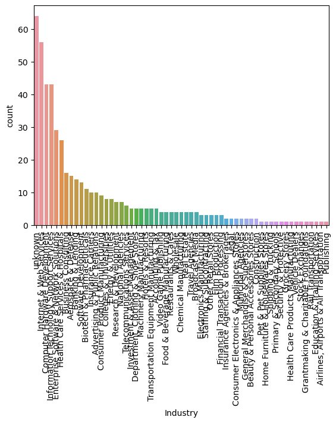
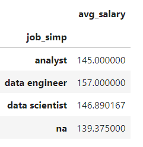
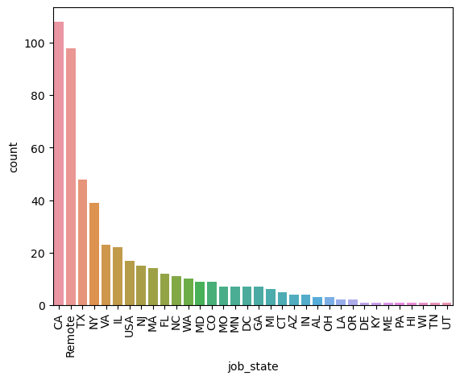
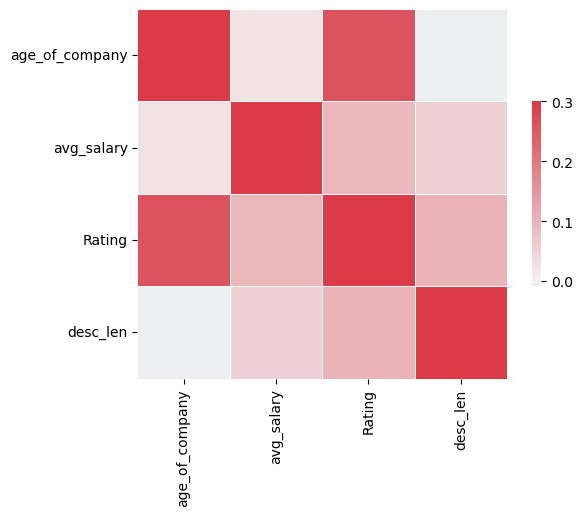
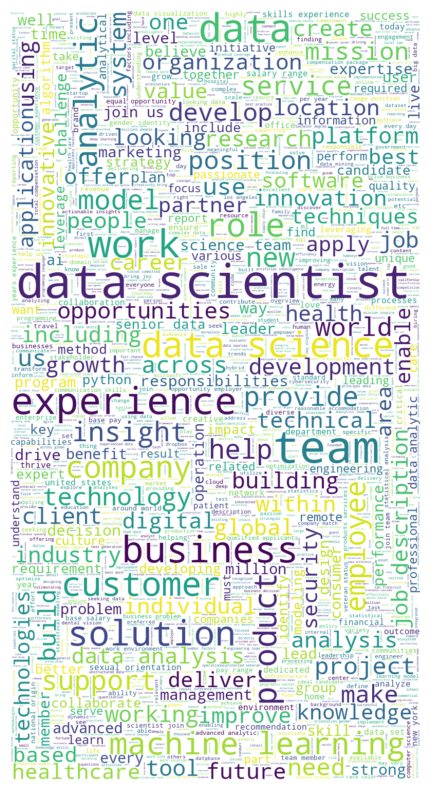

# Data Scientist Salary Estimator 💰

Created a tool that estimates data scientists' salaries as of 2023 with the aim of helping data scientists stay informed during salary negotiations.

## Sources
All credit for Tutorial, Project Idea, and Inspiration goes to [Ken Jee](https://github.com/PlayingNumbers/ds_salary_proj) ([Ken's YouTube Tutorial])(https://youtu.be/MpF9HENQjDo?si=zJfik7fCzgT3uU9V)

## Key Features
- Scraped over 500 job descriptions from Glassdoor using `selenium`
- Developed quantitative measures from job descriptions to assess the emphasis companies place on skills such as Python, Excel, AWS, and Spark.
- Enhanced the performance of Linear, Lasso, and Random Forest Regressors by employing `GridSearchCV` for systematic hyperparameter tuning, helping to reach the more effective model
- Built a client-facing API using `Flask`

## Other Resources
- Glassdoor Web Scraper originally by [Vinny Sakarya](https://github.com/arapfaik/scraping-glassdoor-selenium) ([Vinny's Article on the Scraper])(https://mersakarya.medium.com/selenium-tutorial-scraping-glassdoor-com-in-10-minutes-3d0915c6d905)
- Flask Productionization Article by [GreekDataGuy](https://towardsdatascience.com/productionize-a-machine-learning-model-with-flask-and-heroku-8201260503d2)

## Steps to Get Predictions
1. For Web Framework Requirements and dependencies: `pip install -r requirements.txt`
2. Start the API server by launching `python wsgi.py` to start the Flask application
3. Test API with `curl` commands: `curl -X GET http://127.0.0.1:5000/predict`

## Enhancements
- Refactored web scraper to be compatible with `Selenium` 4+, incorporating the latest standards and features of the WebDriver interface
- Updated XPaths and CSS selectors to match the new web structure of Glassdoor
- Took advantage of `Selenium`'s improved features, resulting in more efficient and robust scraping operations
- Adjusted EDA techniques to cater to new data types, including more specified analysis and visualizations
- Developed new scripts and algorithms for data cleaning that are tailored to new data types
- During modeling, overcame challenges with dummy variable encoding by ensuring all categorical variables were correctly transformed into a binary 0/1 format, rather than boolean true/false

## Project Breakdown
### Web Scraping
Obtained the following fields:
- Job Title
- Salary Estimate
- Job Description
- Rating
- Company
- Location
- Size
- Founded
- Type Of Ownership
- Industry
- Sector
- Revenue

### Data Cleaning and Feature Engineering
Implemented a series of data cleaning and feature engineering steps to ensure that the data was usable for model. The following modifications and additions were made:
- **Parsed Numeric Data from Salary**: Extracted numerical values from salary data for consistency and analysis readiness
- **Company Rating**: Extracted company ratings from textual data to create a standalone numerical rating column
- **Company State**: Ensured a consistent naming convention for each state
- **Age of Company**: Transformed the 'founded date' into a numerical representation of the company's age
- **Skill-Related Columns**: Created columns to indicate the presence of specific skills in the job description:
  - Python
  - SQL
  - Excel
  - AWS
  - Spark
- **Description Length**: Added a column representing the length of the job description, which can be a factor in job attractiveness and clarity

These steps were crucial in transforming the raw scraped data into a structured format that's suitable for effective modeling and analysis.

### Exploratory Data Analysis (EDA)
#### Industry Distribution
 
- The bar chart indicates a skewed distribution of data science jobs across various industries
- A significant number of positions are concentrated in a few industries, with the 'Biotech & Pharmaceuticals' and 'Insurance' sectors leading
- The long tail of the distribution suggests that data science roles are spread across a diverse range of industries, but with many industries having relatively few positions

#### Average Salary by Job Title
 
- The table displays the average salary for different data science roles
- Data engineers have the highest average salary at $157,000, followed by data scientists at $146,890, and analysts at $145,000
- The remaining job titles have average salaries of $139,375, indicating entry-level or miscellaneous roles

#### Job Distribution by State
 
- The bar chart indicates a high concentration of data science roles in California (CA), followed by states like Texas (TX) and New York (NY)
- There's a notable number of remote positions, suggesting a trend towards flexible, location-independent work in the data science field
- The drop-off in job counts after the top few states suggests that the data science job market is geographically concentrated in specific tech hubs or metropolitan areas

#### Correlation Matrix
 
- There is a positive correlation between average salary and company rating, suggesting that companies with higher ratings may offer better salaries
- The age of the company shows little to no correlation with the average salary, implying that company maturity may not significantly influence salary levels for data scientists
- Description length has a weak positive correlation with average salary, indicating that roles with more detailed job descriptions could potentially offer higher salaries

#### Word Cloud of Job Descriptions
 
- The word cloud suggests that "data scientist" is the most frequent term in job descriptions, highlighting the centrality of this role
- Key skills and concepts associated with the role include "machine learning," "data analysis," "experience," and "business," indicating the importance of technical expertise and business acumen
- Words like "team," "solutions," "help," and "customer" reflect the collaborative and solution-oriented nature of the job
- The prominence of words such as "innovation," "technology," and "future" implies a forward-looking, progressive field that values cutting-edge skills

#### Summary
The data suggests that while data science roles are present in many industries, they are more prevalent in some than others. Salary levels vary with the role, with data engineers earning slightly more on average than data scientists and analysts. Company rating has a positive influence on salary, whereas company age does not show a strong relationship. Job descriptions that are more detailed may be associated with higher-paying roles.
The word cloud and bar chart together paint a picture of the data science job market that values technical expertise, especially in machine learning and data analysis, within a business context. There's a strong emphasis on teamwork and customer-oriented solutions, indicating that soft skills are just as crucial as technical skills. The job market for data scientists is heavily concentrated in tech-centric states like California, but there's also a significant move towards remote work, offering flexibility and indicating a trend that may shape the future of work in this field.

These insights can be instrumental for data science professionals seeking to navigate the job market and for companies aiming to attract top talent by benchmarking their offerings against these findings.

### Model Building
#### Data Preprocessing
- **Dummy Variables**: Converted all categorical variables into dummy/indicator variables to facilitate numerical analysis
- **Data Splitting**: Segregated the dataset into training and test sets, adhering to an 80/20 split to ensure sufficient data for training while retaining a representative test subset for model evaluation

#### Model Evaluation Criteria
- **Mean Absolute Error (MAE)**: Selected MAE as the performance metric due to its intuitive interpretability. It provides a clear average error magnitude per prediction, which is appropriate for this analysis as extreme outliers are not of particular concern

#### Model Experimentation
- **Multiple Linear Regression**: Established as the baseline model, it serves as a point of reference for evaluating the performance improvements of more complex models
- **Lasso Regression**: Chosen for its ability to perform feature selection and handle the sparsity resulting from the extensive set of dummy variables. Its regularization properties help in mitigating overfitting and improving model generalizability
- **Random Forest**: Selected due to its robustness in handling sparse data and its non-linear modeling capabilities. It is expected to capture complex patterns and interactions between features that linear models may miss

The rationale behind each model choice is rooted in the unique characteristics of the data. The diverse set of models allows for a comprehensive analysis of the dataset's predictive capabilities and the identification of the most suitable modeling approach for salary prediction.
In comparative analysis, the Random Forest model significantly surpassed the performance of alternative models when assessed on both the test and validation datasets.

### Productionization
Successfully developed and deployed a `Flask` API endpoint, which was locally hosted on a web server. The API endpoint is designed to accept a JSON request containing an array of attributes from a job listing and, in response, it provides an estimated salary prediction. This functionality effectively demonstrates the practical application of this predictive model in a real-world scenario.
